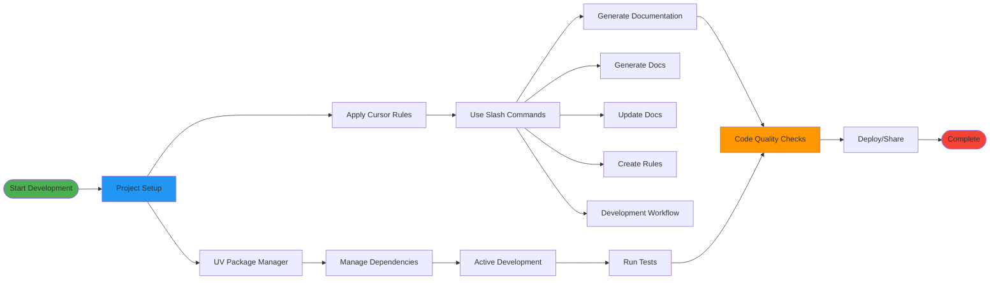

# Awesome Things

A comprehensive collection of awesome development tools, resources, and documentation that make development and life better. This repository serves as both a curated collection of useful resources and a practical guide for modern development workflows.

## 🏷️ Badges

[](https://opensource.org/licenses/MIT)
[](https://python.org)
[](https://docs.astral.sh/uv/)
[](https://cursor.com)
[](docs/)

## 📋 Table of Contents

- [🏷️ Badges](#️-badges)
- [📊 Project Architecture](#-project-architecture)
- [🔄 Development Workflow](#-development-workflow)
- [✨ Key Features](#-key-features)
- [🚀 What's Inside](#-whats-inside)
- [🏗️ Repository Structure](#️-repository-structure)
- [🚀 Quick Start](#-quick-start)
- [📖 Documentation Highlights](#-documentation-highlights)
- [🛠️ Technologies Covered](#️-technologies-covered)
- [🎯 Use Cases](#-use-cases)
- [🔧 Troubleshooting](#-troubleshooting)
- [🤝 Contributing](#-contributing)
- [📝 License](#-license)
- [🙏 Acknowledgments](#-acknowledgments)
- [🔗 Links](#-links)

## 📊 Project Architecture

```mermaid
flowchart TD
    A[Awesome Things Repository] --> B[Documentation]
    A --> C[Cursor IDE Configuration]
    A --> D[Development Tools]
    
    B --> B1[Comprehensive Guides]
    B --> B2[Best Practices]
    B --> B3[Workflow Documentation]
    
    C --> C1[Custom Rules]
    C --> C2[Slash Commands]
    C --> C3[MCP Integration]
    
    D --> D1[UV Python Manager]
    D --> D2[Code Quality Tools]
    D --> D3[Development Workflows]
    
    C1 --> E[Global Standards]
    C1 --> F[UV Python Rules]
    
    C2 --> G[Generate Docs]
    C2 --> H[Update Docs]
    C2 --> I[Setup Projects]
    C2 --> J[Development Workflows]
    
    C3 --> K[Ref MCP]
    C3 --> L[Exa MCP]
    
    D1 --> M[Package Management]
    D1 --> N[Project Setup]
    D1 --> O[Dependency Management]
    
    D2 --> P[Black Formatting]
    D2 --> Q[Ruff Linting]
    D2 --> R[MyPy Type Checking]
    D2 --> S[Pytest Testing]
    
    style A fill:#e1f5fe
    style B fill:#f3e5f5
    style C fill:#e8f5e8
    style D fill:#fff3e0
```



## 🔄 Development Workflow



## ✨ Key Features

### 🚀 Modern Development Stack

- **Cursor IDE Integration** - AI-powered development with custom rules and commands
- **UV Python Package Manager** - 10-100x faster than traditional tools
- **MCP Tool Integration** - Automated research and documentation generation
- **Comprehensive Documentation** - Complete guides and best practices

### 📚 Documentation System

- **Automated Generation** - AI-powered documentation creation using Ref MCP and Exa MCP
- **Comprehensive Guides** - Step-by-step tutorials for modern development workflows
- **Best Practices** - Industry-standard patterns and conventions
- **Visual Architecture** - Mermaid diagrams for clear project understanding

### 🛠️ Development Tools

- **Code Quality** - Black, Ruff, MyPy, and pytest integration
- **Project Templates** - Ready-to-use configurations for various project types
- **Workflow Automation** - Streamlined development processes
- **Team Collaboration** - Shared rules and standards for consistent development

## 🚀 What's Inside

### 📚 Documentation

- **[Cursor IDE .cursor Folder Guide](docs/cursor-folder-guide.md)** - Complete guide to customising Cursor IDE with rules and commands
- **[UV Python Package Manager Guide](docs/uv-python-guide.md)** - Comprehensive guide to using UV for Python development
- **[Docker UV Guide](docs/docker-uv-guide.md)** - Docker containerisation with UV Python package manager
- **[GitHub Actions CI/CD Guide](docs/github-actions-cicd-guide.md)** - Continuous integration and deployment workflows
- **[GitHub Copilot Guide](docs/github-copilot-guide.md)** - AI-powered coding assistance

### 🛠️ Cursor IDE Configuration

This repository includes a complete Cursor IDE setup with custom rules and commands:

#### **Rules (`.cursor/rules/`)**

- **`global.mdc`** - Global project rules and coding standards
- **`uv-python.mdc`** - UV Python package manager development standards
- **`docker-uv-python.mdc`** - Docker containerisation with UV Python standards

#### **Commands (`.cursor/commands/`)**

- **`generate-docs.md`** - Automatically research and generate comprehensive documentation
- **`update-docs.md`** - Update existing documentation with latest information
- **`create-rules-commands.md`** - Create custom Cursor rules and commands
- **`setup-uv-project.md`** - Initialize new Python projects with UV
- **`uv-development-workflow.md`** - Execute comprehensive UV development workflows

## 🏗️ Repository Structure

```text
awesome_things/
├── docs/                           # Comprehensive documentation
│   ├── cursor-folder-guide.md     # Cursor IDE configuration guide
│   └── uv-python-guide.md         # UV Python package manager guide
├── .cursor/                        # Cursor IDE configuration
│   ├── rules/                      # Custom development rules
│   │   ├── global.mdc             # Global project standards
│   │   └── uv-python.mdc          # UV Python development rules
│   └── commands/                   # Custom slash commands
│       ├── generate-docs.md       # Documentation generation
│       ├── update-docs.md         # Documentation updates
│       ├── create-rules-commands.md # Rule and command creation
│       ├── setup-uv-project.md    # Project initialization
│       └── uv-development-workflow.md # Development workflows
├── .gitignore                     # Git ignore configuration
└── README.md                      # This file
```

## 🚀 Quick Start

### Prerequisites

Before you begin, ensure you have the following installed:

- **Cursor IDE** - Download from [cursor.com](https://cursor.com)
- **UV Python Package Manager** - Install using the command below
- **Git** - For version control

### Installation

#### 1. Install UV Python Package Manager

```bash
# Install UV (works on macOS, Linux, and Windows)
curl -LsSf https://astral.sh/uv/install.sh | sh

# Restart your terminal or run:
source ~/.bashrc  # or ~/.zshrc
```

#### 2. Clone This Repository

```bash
git clone https://github.com/CodeWithBehnam/awesome_things.git
cd awesome_things
```

### Using Cursor IDE Commands

The repository includes custom slash commands for streamlined development:

#### 📚 Documentation Commands

```bash
# Generate comprehensive documentation
/generate-docs Create comprehensive documentation about [topic]

# Update existing documentation
/update-docs Update the existing documentation with latest information
```

#### ⚙️ Configuration Commands

```bash
# Create custom rules and commands
/create-rules-commands Create rules and commands for [technology/framework]

# Setup new UV Python project
/setup-uv-project Create a new FastAPI web application with testing tools
```

#### 🔄 Development Workflow Commands

```bash
# Run comprehensive development tasks
/uv-development-workflow Run daily development tasks including code quality checks
```

### Using UV Python Package Manager

#### Create a New Project

```bash
# Initialize a new project
uv init my-awesome-project
cd my-awesome-project

# Pin Python version
uv python pin 3.12

# Add dependencies
uv add requests flask sqlalchemy
uv add --dev pytest black ruff mypy
```

#### Development Workflow

```bash
# Run your application
uv run python main.py

# Run tests
uv run pytest

# Format code
uv run black .

# Lint code
uv run ruff check .

# Type checking
uv run mypy .
```

#### Package Management

```bash
# Add new dependencies
uv add package-name

# Add development dependencies
uv add --dev package-name

# Remove packages
uv remove package-name

# Sync dependencies
uv sync
```

## 📖 Documentation Highlights

### Cursor IDE Guide

- **Complete .cursor folder structure** with rules and commands
- **MCP tool integration** for automated research and documentation
- **Best practices** for team collaboration and code quality
- **Custom workflows** for streamlined development

### UV Python Guide

- **Modern package management** with 10-100x speed improvements
- **Comprehensive project setup** with best practices
- **Development workflows** for all project types
- **Migration guides** from pip, Poetry, and Conda

## 🛠️ Technologies Covered

- **Cursor IDE** - AI-powered code editor with custom rules and commands
- **UV Python** - Modern Python package manager written in Rust
- **MCP Tools** - Ref MCP and Exa MCP for automated research
- **Python Development** - Web apps, APIs, data science, CLI tools
- **Code Quality** - Black, Ruff, MyPy, pytest, pre-commit hooks

## 🎯 Use Cases

### For Developers

- **Streamline development workflows** with custom Cursor commands
- **Modernise Python development** with UV package manager
- **Automate documentation** generation and updates
- **Standardise team practices** with shared rules and commands

### For Teams

- **Consistent development environments** across team members
- **Automated code quality** checks and standards
- **Comprehensive documentation** for onboarding and reference
- **Best practices** for modern Python development

### For Projects

- **Quick project setup** with UV and Cursor integration
- **Comprehensive documentation** generation and maintenance
- **Quality assurance** with automated checks and standards
- **Scalable development** workflows for any project size

## 🔧 Troubleshooting

### Common Issues

#### UV Installation Problems

```bash
# If UV installation fails, try:
curl -LsSf https://astral.sh/uv/install.sh | sh --force

# For Windows users, use PowerShell:
powershell -c "irm https://astral.sh/uv/install.ps1 | iex"
```

#### Cursor IDE Commands Not Working

1. Ensure you're in a project with `.cursor` folder
2. Check that commands are properly formatted
3. Restart Cursor IDE if commands don't appear

#### Python Environment Issues

```bash
# Reset UV environment
uv sync --reinstall

# Clear UV cache
uv cache clean
```

### Getting Help

- **Documentation Issues**: Check the relevant guide in the `docs/` folder
- **UV Problems**: Visit [UV Documentation](https://docs.astral.sh/uv/)
- **Cursor IDE Issues**: Check [Cursor Documentation](https://cursor.com/docs)

## 🤝 Contributing

We welcome contributions to make this collection even more awesome! Here's how you can contribute:

### 🎯 How to Contribute

#### Adding New Content

1. **Fork the repository** and create a feature branch
2. **Add your awesome discovery** to the appropriate section
3. **Update documentation** if needed
4. **Test your changes** thoroughly
5. **Submit a pull request** with a clear description

#### Improving Existing Content

1. **Identify areas for improvement** in documentation or rules
2. **Make your changes** following the established patterns
3. **Test your changes** to ensure they work correctly
4. **Update related documentation** as needed
5. **Submit a pull request** with details about your improvements

#### Creating New Rules and Commands

1. **Follow the established patterns** in existing rules and commands
2. **Include comprehensive documentation** and examples
3. **Test thoroughly** to ensure they work as expected
4. **Add to the appropriate guide** in the `docs/` folder
5. **Submit a pull request** with your new additions

### 📋 Contribution Guidelines

- **Code Quality**: Follow the established coding standards
- **Documentation**: Update relevant documentation for any changes
- **Testing**: Ensure all changes work as expected
- **Commit Messages**: Use clear, descriptive commit messages
- **Pull Requests**: Provide detailed descriptions of changes

### 🏷️ Issue Labels

- `bug` - Something isn't working
- `enhancement` - New feature or request
- `documentation` - Improvements or additions to documentation
- `help wanted` - Extra attention is needed
- `good first issue` - Good for newcomers

## 📝 License

This project is open source and available under the [MIT License](LICENSE).

## 🙏 Acknowledgments

- **Cursor IDE** - For providing an amazing AI-powered development environment
- **UV Python** - For revolutionizing Python package management
- **Astral** - For creating incredible Rust-based Python tools
- **Community** - For sharing awesome tools and resources

## 🔗 Links

- **Repository**: [https://github.com/CodeWithBehnam/awesome_things](https://github.com/CodeWithBehnam/awesome_things)
- **Cursor IDE**: [https://cursor.com](https://cursor.com)
- **UV Python**: [https://docs.astral.sh/uv/](https://docs.astral.sh/uv/)
- **MCP Tools**: [https://docs.ref.tools/](https://docs.ref.tools/)

---

## 💝 Made with ❤️ for the developer community
