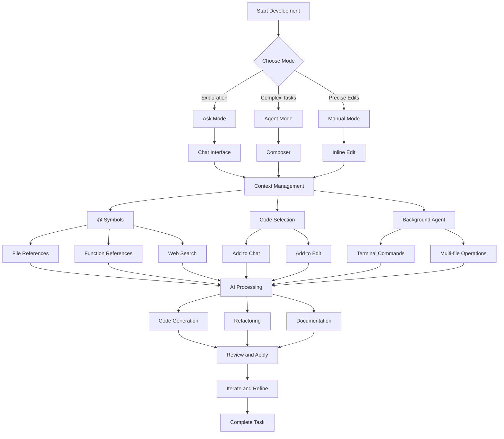

# Cursor Commands Guide: Master Your AI-Powered Development Workflow

## Table of Contents

1. [Overview](#overview)
2. [Essential Keyboard Shortcuts](#essential-keyboard-shortcuts)
3. [AI-Powered Features](#ai-powered-features)
4. [Context Management](#context-management)
5. [Advanced Workflow Commands](#advanced-workflow-commands)
6. [Terminal Integration](#terminal-integration)
7. [Customisation and Configuration](#customisation-and-configuration)
8. [Best Practices](#best-practices)
9. [Troubleshooting](#troubleshooting)
10. [Resources](#resources)

## Overview

Cursor is an AI-first code editor that transforms your development workflow through intelligent automation and context-aware assistance. This comprehensive guide covers the most powerful commands and shortcuts that will dramatically enhance your productivity.

### Key Benefits

- **AI-First Architecture**: Deep integration with large language models
- **Context-Aware Assistance**: Understands your entire codebase
- **Multi-File Operations**: Edit multiple files simultaneously
- **Intelligent Automation**: Background agents and workflow automation
- **Extensible Ecosystem**: MCP (Model Context Protocol) integration

### Cursor Workflow Overview



## Essential Keyboard Shortcuts

### General Navigation

| Shortcut | Action | Description |
|----------|--------|-------------|
| `Ctrl/Cmd + Shift + P` | Command Palette | Access all commands and features |
| `Ctrl/Cmd + ,` | Settings | Open general settings |
| `Ctrl/Cmd + Shift + J` | Cursor Settings | Open Cursor-specific settings |
| `Ctrl/Cmd + I` | Toggle Sidepanel | Open/close sidepanel (unless bound to mode) |
| `Ctrl/Cmd + L` | Toggle Sidepanel | Alternative sidepanel toggle |
| `Ctrl/Cmd + B` | Toggle Sidebar | Show/hide file explorer |
| `Ctrl/Cmd + \`` | Toggle Terminal | Open/close integrated terminal |
| `Ctrl/Cmd + N` | New File | Create new file |
| `Ctrl/Cmd + S` | Save File | Save current file |
| `Ctrl/Cmd + W` | Close Tab | Close current tab |

### Code Navigation

| Shortcut | Action | Description |
|----------|--------|-------------|
| `Ctrl/Cmd + P` | Quick Open | Open file by name |
| `Ctrl/Cmd + G` | Go to Line | Jump to specific line number |
| `Ctrl/Cmd + Shift + O` | Go to Symbol | Navigate to functions, classes, etc. |
| `F12` | Go to Definition | Jump to symbol definition |
| `Alt + Left/Right` | Navigate Back/Forward | Move through navigation history |
| `Ctrl/Cmd + F` | Find in File | Search within current file |
| `Ctrl/Cmd + Shift + F` | Find in Project | Search across entire project |

## AI-Powered Features

### Chat Interface

| Shortcut | Action | Description |
|----------|--------|-------------|
| `Ctrl/Cmd + L` | Open Chat | Launch AI chat interface |
| `Enter` | Nudge (default) | Send message with default behaviour |
| `Ctrl/Cmd + Enter` | Queue Message | Queue message for processing |
| `Ctrl/Cmd + Enter` (when typing) | Force Send | Send message immediately |
| `Ctrl/Cmd + Shift + BackSpace` | Cancel Generation | Stop AI generation |
| `Ctrl/Cmd + Shift + L` (with code selected) | Add Selection to Chat | Include selected code as context |
| `Ctrl/Cmd + V` (with code in clipboard) | Add Clipboard as Context | Include clipboard content |
| `Ctrl/Cmd + Shift + V` (with code in clipboard) | Add Clipboard to Input | Paste clipboard into input box |
| `Ctrl/Cmd + Enter` (with suggested changes) | Accept All Changes | Apply all AI suggestions |
| `Ctrl/Cmd + BackSpace` | Reject All Changes | Discard all AI suggestions |
| `Tab` | Cycle to Next Message | Navigate through message history |
| `Shift + Tab` | Cycle to Previous Message | Navigate backwards through history |
| `Ctrl/Cmd + Alt + /` | Model Toggle | Switch between AI models |
| `Ctrl/Cmd + N` / `Ctrl/Cmd + R` | New Chat | Start new conversation |
| `Ctrl/Cmd + T` | New Chat Tab | Open chat in new tab |
| `Ctrl/Cmd + [` | Previous Chat | Navigate to previous chat |
| `Ctrl/Cmd + ]` | Next Chat | Navigate to next chat |
| `Ctrl/Cmd + W` | Close Chat | Close current chat |
| `Esc` | Unfocus Field | Exit chat input |

### Composer (Multi-File Editing)

| Shortcut | Action | Description |
|----------|--------|-------------|
| `Ctrl/Cmd + I` | Open Composer | Launch multi-file editor |
| `Ctrl/Cmd + Shift + I` | Full-Screen Composer | Open composer in full-screen mode |
| `Ctrl/Cmd + BackSpace` | Cancel Generation | Stop current operation |
| `Ctrl/Cmd + Enter` | Accept All Changes | Apply all suggested changes |
| `Ctrl/Cmd + BackSpace` | Reject All Changes | Discard all suggestions |
| `Tab` | Cycle to Next Message | Navigate through composer history |
| `Shift + Tab` | Cycle to Previous Message | Navigate backwards |
| `Ctrl/Cmd + Alt + /` | Open Model Toggle | Switch AI models |
| `Ctrl/Cmd + N` | Create New Composer | Start new composer session |
| `Ctrl/Cmd + R` | Create New Composer | Alternative new composer command |
| `Ctrl/Cmd + Shift + K` | Open Composer as Bar | Launch composer in bar mode |
| `Ctrl/Cmd + [` | Previous Composer | Navigate to previous session |
| `Ctrl/Cmd + ]` | Next Composer | Navigate to next session |
| `Ctrl/Cmd + W` | Close Composer | Close current composer |
| `↑` | Select Previous Message | Navigate through message history |

### Inline Editing (Cmd+K)

| Shortcut | Action | Description |
|----------|--------|-------------|
| `Ctrl/Cmd + K` | Open Inline Edit | Launch inline editing mode |
| `Ctrl/Cmd + Shift + K` | Toggle Input Focus | Switch focus to input field |
| `Enter` | Submit | Apply inline edit |
| `Ctrl/Cmd + Shift + BackSpace` | Cancel | Discard inline edit |
| `Alt + Enter` | Ask Quick Question | Pose quick question in context |

### Cursor Tab (AI Code Completion)

| Shortcut | Action | Description |
|----------|--------|-------------|
| `Tab` | Accept Suggestion | Accept AI code completion |
| `Esc` | Reject Suggestion | Dismiss AI suggestion |
| `Ctrl/Cmd + →` | Partial Accept | Accept next word of suggestion |
| `Ctrl/Cmd + Arrow-Right` | Accept Next Word | Alternative partial accept |

## Context Management

### @ Symbols (Context References)

| Symbol | Purpose | Usage Example |
|--------|---------|---------------|
| `@filename` | Reference File | `@src/components/Button.tsx` |
| `@functionName` | Reference Function | `@calculateTotal` |
| `@variableName` | Reference Variable | `@userData` |
| `@codebase` | Search Codebase | `@codebase authentication logic` |
| `@web` | Search Web | `@web React best practices 2024` |
| `@docs` | Reference Documentation | `@docs API reference` |
| `@terminal` | Include Terminal Output | `@terminal npm install logs` |
| `@git` | Git Context | `@git recent commits` |

### Code Selection & Context

| Shortcut | Action | Description |
|----------|--------|-------------|
| `@` | @-symbols | Access context reference menu |
| `#` | Files | Reference specific files |
| `/` | Shortcut Commands | Access command shortcuts |
| `Ctrl/Cmd + Shift + L` | Add Selection to Chat | Include selected code in chat |
| `Ctrl/Cmd + Shift + K` | Add Selection to Edit | Include selected code in edit |
| `Ctrl/Cmd + L` | Add Selection to New Chat | Start new chat with selection |
| `Ctrl/Cmd + M` | Toggle File Reading Strategies | Change how files are read |
| `Ctrl/Cmd + Arrow-Right` | Accept Next Word of Suggestion | Partial accept for suggestions |
| `Ctrl/Cmd + Enter` | Search Codebase in Chat | Search project from chat |
| Select code, `Ctrl/Cmd + C`, `Ctrl/Cmd + V` | Add Copied Reference Code | Include copied code as reference |
| Select code, `Ctrl/Cmd + C`, `Ctrl/Cmd + Shift + V` | Add Copied Code as Text | Include copied code as text |

## Advanced Workflow Commands

### Background Agent

| Shortcut | Action | Description |
|----------|--------|-------------|
| `Ctrl/Cmd + E` | Background Agent Control Panel | Access background agent settings |
| `Ctrl/Cmd + .` | Mode Menu | Toggle between different modes |

### Model Management

| Shortcut | Action | Description |
|----------|--------|-------------|
| `Ctrl/Cmd + /` | Loop Between AI Models | Cycle through available models |
| `Ctrl/Cmd + Alt + /` | Model Toggle | Switch AI models |

### Advanced Features

| Feature | Command | Description |
|---------|---------|-------------|
| **Agent Mode** | Toggle in Composer | Autonomous task execution with guardrails |
| **Ask Mode** | Default Chat Mode | Read-only exploration and Q&A |
| **Manual Mode** | Targeted Edits | Precise, controlled code modifications |
| **YOLO Mode** | Auto-approve Changes | Automatic application of AI suggestions |

## Terminal Integration

| Shortcut | Action | Description |
|----------|--------|-------------|
| `Ctrl/Cmd + K` | Open Terminal Prompt Bar | Launch terminal with AI assistance |
| `Ctrl/Cmd + Enter` | Run Generated Command | Execute AI-generated terminal command |
| `Esc` | Accept Command | Confirm terminal command |

### Terminal Workflow Examples

```bash
# AI-assisted terminal commands
cursor-agent ls                    # List all previous chats
cursor-agent resume               # Resume latest conversation
cursor-agent --resume="chat-id"   # Resume specific chat
```

## Customisation and Configuration

### Rules and Memories

#### Creating Custom Rules

Create `.cursor/rules/` directory and add `.mdc` files:

```markdown
# Example: backend.fastapi.mdc
- Use FastAPI's dependency injection for database sessions
- Use Pydantic models for request/response schemas
- Follow RESTful API design for routes
- Include proper error handling and logging
```

#### Memory Management

- **Rules**: Project-specific coding guidelines and architectural patterns
- **Memories**: Persistent context that persists across sessions
- **Context**: Session-specific information and current state

### Configuration Files

#### .cursorignore
```gitignore
# Exclude from indexing
node_modules/
*.log
.env
dist/
build/
```

#### .cursorindexignore
```gitignore
# Alternative ignore file
*.min.js
*.bundle.js
coverage/
```

## Command Reference Examples

### Essential Workflow Commands

#### 1. Quick File Operations
```bash
# Open file by name
Ctrl/Cmd + P → type filename

# Go to specific line
Ctrl/Cmd + G → enter line number

# Find symbol in file
Ctrl/Cmd + Shift + O → type function/class name
```

#### 2. AI-Assisted Development
```bash
# Start new chat with context
Ctrl/Cmd + L → type your question

# Add selected code to chat
Select code → Ctrl/Cmd + Shift + L

# Open composer for multi-file editing
Ctrl/Cmd + I → describe your changes

# Inline edit current code
Ctrl/Cmd + K → describe the edit
```

#### 3. Context Management
```bash
# Reference specific file
@filename → select from dropdown

# Reference function
@functionName → select from list

# Search codebase
@codebase → enter search query

# Include web information
@web → enter search query
```

### Advanced Usage Patterns

#### Multi-File Refactoring
1. Open Composer (`Ctrl/Cmd + I`)
2. Enable Agent Mode
3. Describe the refactoring task
4. Reference relevant files with `@filename`
5. Review and apply changes

#### Debugging Workflow
1. Select problematic code
2. Open Chat (`Ctrl/Cmd + L`)
3. Add selection to context (`Ctrl/Cmd + Shift + L`)
4. Describe the issue
5. Follow AI suggestions

#### Documentation Generation
1. Select code to document
2. Use Inline Edit (`Ctrl/Cmd + K`)
3. Prompt: "Add comprehensive documentation and examples"
4. Review generated documentation
5. Apply changes

## Best Practices

### 1. Context Management

- **Use @ symbols strategically**: Reference specific files, functions, or code sections
- **Provide clear context**: Include relevant code snippets and error messages
- **Leverage codebase indexing**: Let Cursor understand your project structure

### 2. Prompt Engineering

- **Be specific**: Clearly define requirements and constraints
- **Include examples**: Show desired patterns and implementations
- **Iterate and refine**: Treat AI output as drafts to be improved

### 3. Workflow Optimisation

- **Start with PRD**: Create Product Requirements Documents for complex projects
- **Use appropriate modes**: Agent for complex tasks, Ask for exploration, Manual for precise edits
- **Leverage background agents**: Automate routine tasks and workflows

### 4. Code Quality

- **Request comprehensive output**: Ask for tests, documentation, and logging
- **Review AI suggestions**: Always validate generated code
- **Maintain consistency**: Use rules to enforce coding standards

### 5. Advanced Techniques

- **Multi-file operations**: Use Composer for complex refactoring
- **Terminal integration**: Combine AI assistance with command-line tools
- **MCP integration**: Extend functionality with Model Context Protocol servers

## Troubleshooting

### Common Issues

#### AI Not Following Instructions
- **Solution**: Provide more specific context using @ symbols
- **Check**: Ensure rules are properly configured
- **Verify**: Model selection and mode settings

#### Performance Issues
- **Solution**: Exclude unnecessary files from indexing
- **Check**: .cursorignore and .cursorindexignore files
- **Optimise**: Reduce context size and complexity

#### Terminal Commands Not Executing
- **Solution**: Ensure agent mode is enabled in Composer
- **Check**: Terminal permissions and environment
- **Verify**: Command syntax and parameters

#### Context Not Being Applied
- **Solution**: Use explicit @ references
- **Check**: File indexing status
- **Verify**: Context relevance and specificity

### Debugging Tips

1. **Enable verbose logging**: Check Cursor settings for debug options
2. **Clear cache**: Reset indexing and context cache
3. **Update regularly**: Ensure latest version for bug fixes
4. **Check community**: Forum and documentation for known issues

## Resources

### Official Documentation
- [Cursor Official Docs](https://docs.cursor.com/)
- [Keyboard Shortcuts Reference](https://docs.cursor.com/en/configuration/kbd)
- [Context Management Guide](https://docs.cursor.com/en/context/)
- [Agent Overview](https://docs.cursor.com/en/agent/overview)

### Community Resources
- [Cursor Forum](https://forum.cursor.com/)
- [Awesome Cursor Rules](https://github.com/PatrickJS/awesome-cursorrules)
- [Cursor Rules Repository](https://github.com/sparesparrow/cursor-rules)

### MCP Integration
- [Model Context Protocol](https://docs.anthropic.com/en/docs/agents-and-tools/mcp)
- [Cursor MCP Documentation](https://docs.cursor.com/en/context/mcp)
- [MCP Server Directory](https://cursor.directory/)

### Learning Resources
- [Cursor 101](https://cursor101.com/)
- [Cursor Cheat Sheet](https://cursorcheatsheet.com/)
- [Advanced Cursor Techniques](https://educative.io/courses/advanced-cursor-ai)

## Quick Reference Card

### Most Essential Commands

| Action | Shortcut | Use Case |
|--------|----------|----------|
| **Open Chat** | `Ctrl/Cmd + L` | Ask questions, get help |
| **Open Composer** | `Ctrl/Cmd + I` | Multi-file editing |
| **Inline Edit** | `Ctrl/Cmd + K` | Quick code modifications |
| **Command Palette** | `Ctrl/Cmd + Shift + P` | Access all features |
| **Accept Suggestion** | `Tab` | Use AI code completion |
| **Add to Context** | `Ctrl/Cmd + Shift + L` | Include selected code |

### Context References

| Symbol | Purpose | Example |
|--------|---------|---------|
| `@filename` | Reference file | `@src/App.tsx` |
| `@function` | Reference function | `@calculateTotal` |
| `@codebase` | Search project | `@codebase auth` |
| `@web` | Web search | `@web React hooks` |

### Mode Selection

| Mode | Best For | Activation |
|------|----------|------------|
| **Ask** | Exploration, Q&A | Default chat mode |
| **Agent** | Complex tasks | Toggle in Composer |
| **Manual** | Precise edits | Targeted modifications |

### File Operations

| Action | Shortcut | Description |
|--------|----------|-------------|
| **Quick Open** | `Ctrl/Cmd + P` | Open file by name |
| **Go to Line** | `Ctrl/Cmd + G` | Jump to line number |
| **Go to Symbol** | `Ctrl/Cmd + Shift + O` | Find functions/classes |
| **Find in File** | `Ctrl/Cmd + F` | Search current file |
| **Find in Project** | `Ctrl/Cmd + Shift + F` | Search entire project |

### AI Features

| Feature | Shortcut | Description |
|---------|----------|-------------|
| **Accept Suggestion** | `Tab` | Use AI completion |
| **Reject Suggestion** | `Esc` | Dismiss AI suggestion |
| **Partial Accept** | `Ctrl/Cmd + →` | Accept next word |
| **Model Toggle** | `Ctrl/Cmd + /` | Switch AI models |
| **Cancel Generation** | `Ctrl/Cmd + Shift + BackSpace` | Stop AI processing |

---

*This guide provides comprehensive coverage of Cursor's most powerful commands and features. Regular updates ensure compatibility with the latest Cursor releases and best practices.*
