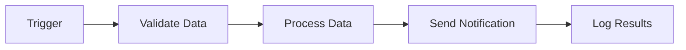
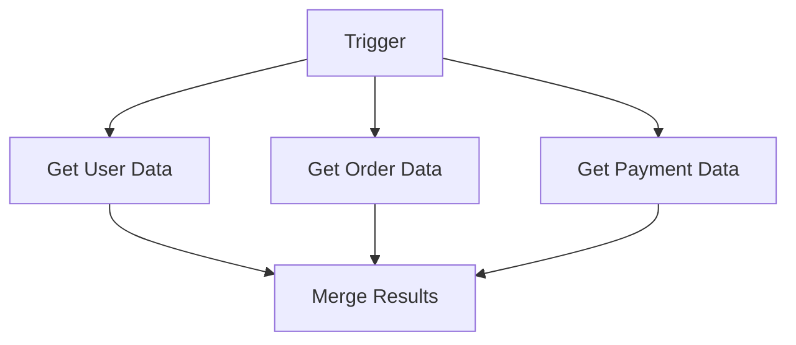
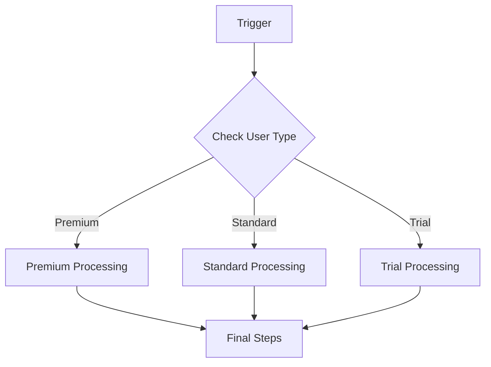
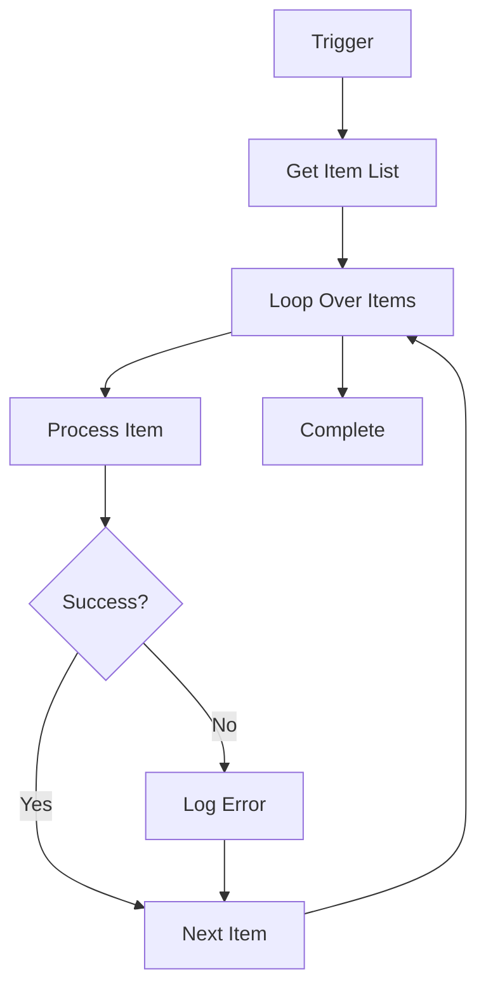

# n8n Workflow Creation Best Practices Guide

A comprehensive guide to building efficient, scalable, and maintainable n8n workflows using industry-proven best practices and modern automation patterns.

## Table of Contents

- [Overview](#overview)
- [Core Design Principles](#core-design-principles)
- [Workflow Architecture Patterns](#workflow-architecture-patterns)
- [Error Handling and Resilience](#error-handling-and-resilience)
- [Security Best Practices](#security-best-practices)
- [Performance Optimisation](#performance-optimisation)
- [Data Management](#data-management)
- [Testing and Quality Assurance](#testing-and-quality-assurance)
- [Documentation and Maintenance](#documentation-and-maintenance)
- [Advanced Patterns](#advanced-patterns)
- [Troubleshooting Guide](#troubleshooting-guide)
- [Resources and References](#resources-and-references)

## Overview

n8n is a powerful workflow automation platform that enables you to connect different services and automate complex business processes. However, building production-ready workflows requires more than just connecting nodes—it demands thoughtful design, robust error handling, and adherence to best practices that ensure reliability, security, and maintainability.

This guide provides comprehensive best practices for creating n8n workflows that are not only functional but also scalable, secure, and easy to maintain. Whether you're building simple automations or complex enterprise workflows, these practices will help you create robust solutions that stand the test of time.

## Core Design Principles

### 1. Modular Design Philosophy

**The Problem**: Monolithic workflows become unmanageable as they grow, leading to performance issues, debugging nightmares, and maintenance difficulties.

**The Solution**: Break down complex processes into smaller, single-purpose workflows connected by the `Execute Workflow` node.

#### Benefits of Modular Design

- **Performance**: Smaller workflows render faster and execute more efficiently
- **Debugging**: Easier to isolate and fix issues in specific components
- **Reusability**: Common functionality can be shared across multiple workflows
- **Maintainability**: Changes to one component don't affect others
- **Scalability**: Individual components can be optimised independently

#### Implementation Strategy

```json
{
  "workflow_structure": {
    "main_workflow": "Customer Onboarding Orchestrator",
    "sub_workflows": [
      "Validate Customer Data",
      "Create User Account",
      "Setup Payment Method",
      "Send Welcome Email",
      "Notify Sales Team"
    ]
  }
}
```

#### When to Use Single vs. Modular Workflows

**Use Single Workflow For**:
- Simple, linear processes (3-5 nodes)
- One-time automations
- Processes unlikely to grow in complexity

**Use Modular Design For**:
- Complex business processes
- Workflows with multiple decision points
- Processes that will be reused elsewhere
- Enterprise-level automations

### 2. Data Flow Optimisation

**Early Filtering**: Process only the data you need by filtering at the source or early in the workflow.

```javascript
// Example: Filter active users only
if ($json.status === 'active' && $json.email !== null) {
  return $json;
}
```

**Data Trimming**: Remove unnecessary fields to reduce payload size and improve performance.

```json
{
  "keep_fields": ["id", "name", "email", "status"],
  "remove_fields": ["internal_notes", "debug_info", "temp_data"]
}
```

**Batch Processing**: Handle large datasets in manageable chunks using the `Split in Batches` node.

### 3. Clear Naming Conventions

**Workflow Naming**:
- Use descriptive, purpose-driven names
- Include environment indicators (DEV, STAGING, PROD)
- Add version numbers for iterations

**Examples**:
- `Customer Onboarding - Email Verification v2.1`
- `Daily Sales Report - Slack Notification`
- `PROD - Payment Processing Workflow`

**Node Naming**:
- Describe the specific action being performed
- Include the target system or service
- Avoid generic names like "HTTP Request 1"

**Examples**:
- `Get Customer Data from CRM`
- `Send Welcome Email via SendGrid`
- `Update Order Status in Database`

## Workflow Architecture Patterns

### 1. Sequential Processing Pattern

**Use Case**: Linear processes where each step depends on the previous one.



**Best Practices**:
- Validate data early in the sequence
- Use error handling between each step
- Log progress at key checkpoints

### 2. Parallel Processing Pattern

**Use Case**: Independent operations that can run simultaneously.



**Implementation**:
- Use multiple branches from a single trigger
- Merge results using the `Merge` node
- Handle partial failures gracefully

### 3. Conditional Branching Pattern

**Use Case**: Different processing paths based on data conditions.



**Best Practices**:
- Use clear, descriptive conditions
- Document the logic in sticky notes
- Ensure all branches lead to appropriate outcomes

### 4. Loop Processing Pattern

**Use Case**: Processing multiple items or retrying failed operations.



**Implementation Tips**:
- Set appropriate batch sizes
- Implement retry logic for failed items
- Monitor memory usage with large datasets

## Error Handling and Resilience

### 1. Global Error Workflow Pattern

Create a dedicated error handling workflow that catches failures from any other workflow.

#### Error Workflow Structure

```json
{
  "error_workflow": {
    "trigger": "Error Trigger",
    "nodes": [
      "Parse Error Details",
      "Determine Error Severity",
      "Log to Database",
      "Send Alert Notification",
      "Attempt Recovery (if applicable)"
    ]
  }
}
```

#### Error Workflow Implementation

1. **Error Trigger Node**: Catches all unhandled errors
2. **Error Analysis**: Parse error details and categorise severity
3. **Logging**: Store error information for analysis
4. **Notification**: Alert relevant team members
5. **Recovery**: Attempt automatic recovery where possible

### 2. Inline Error Handling

Handle predictable errors within the workflow using node-level error settings.

#### Node Error Settings

```json
{
  "error_handling": {
    "continue_on_fail": true,
    "retry_on_fail": {
      "enabled": true,
      "max_attempts": 3,
      "wait_time": "exponential_backoff"
    },
    "error_output": "use_error_output"
  }
}
```

#### Common Error Scenarios

**API Rate Limiting**:
```javascript
// Check for rate limit headers
if ($json.headers['x-ratelimit-remaining'] === '0') {
  // Wait and retry
  return { wait_time: $json.headers['x-ratelimit-reset'] };
}
```

**Data Validation Errors**:
```javascript
// Validate required fields
const requiredFields = ['email', 'name', 'phone'];
const missingFields = requiredFields.filter(field => !$json[field]);

if (missingFields.length > 0) {
  throw new Error(`Missing required fields: ${missingFields.join(', ')}`);
}
```

**Network Timeouts**:
```json
{
  "timeout_settings": {
    "request_timeout": 30000,
    "retry_attempts": 3,
    "backoff_strategy": "exponential"
  }
}
```

### 3. Retry Mechanisms

#### Exponential Backoff Strategy

```javascript
// Calculate retry delay with exponential backoff
const baseDelay = 1000; // 1 second
const maxDelay = 30000; // 30 seconds
const attempt = $json.retry_attempt || 1;
const delay = Math.min(baseDelay * Math.pow(2, attempt - 1), maxDelay);

return { delay: delay, attempt: attempt + 1 };
```

#### Circuit Breaker Pattern

```javascript
// Implement circuit breaker logic
const failureThreshold = 5;
const recoveryTimeout = 300000; // 5 minutes

if ($json.consecutive_failures >= failureThreshold) {
  if (Date.now() - $json.last_failure_time < recoveryTimeout) {
    throw new Error('Circuit breaker open - service unavailable');
  }
}
```

### 4. Dead Letter Queue Pattern

For critical workflows, implement a dead letter queue to handle permanently failed items.

```json
{
  "dead_letter_queue": {
    "trigger": "Manual Trigger",
    "nodes": [
      "Get Failed Items",
      "Analyze Failure Reason",
      "Attempt Manual Recovery",
      "Archive or Delete"
    ]
  }
}
```

## Security Best Practices

### 1. Credential Management

#### Use n8n's Built-in Credential System

**Never hardcode credentials** in workflow nodes. Always use n8n's credential management system.

```json
{
  "credential_management": {
    "best_practices": [
      "Use OAuth2 where possible",
      "Store credentials in n8n's encrypted system",
      "Rotate credentials regularly",
      "Use environment variables for sensitive data",
      "Implement least privilege access"
    ]
  }
}
```

#### Environment Variables

```bash
# Production environment variables
N8N_ENCRYPTION_KEY=your-encryption-key
N8N_USER_MANAGEMENT_DISABLED=false
N8N_PUBLIC_API_DISABLED=true
N8N_WEBHOOK_URL=https://your-domain.com/
```

### 2. Webhook Security

#### Authentication Methods

**Basic Authentication**:
```javascript
// Validate basic auth credentials
const auth = $request.headers.authorization;
if (!auth || !auth.startsWith('Basic ')) {
  throw new Error('Authentication required');
}

const credentials = Buffer.from(auth.split(' ')[1], 'base64').toString();
const [username, password] = credentials.split(':');

if (username !== process.env.WEBHOOK_USERNAME || 
    password !== process.env.WEBHOOK_PASSWORD) {
  throw new Error('Invalid credentials');
}
```

**Token-based Authentication**:
```javascript
// Validate API token
const token = $request.headers['x-api-token'];
if (!token || token !== process.env.WEBHOOK_SECRET_TOKEN) {
  throw new Error('Invalid or missing API token');
}
```

**Signature Verification**:
```javascript
// Verify webhook signature
const signature = $request.headers['x-signature'];
const expectedSignature = crypto
  .createHmac('sha256', process.env.WEBHOOK_SECRET)
  .update(JSON.stringify($request.body))
  .digest('hex');

if (signature !== expectedSignature) {
  throw new Error('Invalid signature');
}
```

### 3. Data Protection

#### Input Validation

```javascript
// Comprehensive input validation
const validateInput = (data) => {
  const errors = [];
  
  // Required field validation
  if (!data.email || !data.email.includes('@')) {
    errors.push('Valid email is required');
  }
  
  // Data type validation
  if (data.age && (typeof data.age !== 'number' || data.age < 0)) {
    errors.push('Age must be a positive number');
  }
  
  // Sanitisation
  if (data.name) {
    data.name = data.name.trim().replace(/[<>]/g, '');
  }
  
  if (errors.length > 0) {
    throw new Error(`Validation errors: ${errors.join(', ')}`);
  }
  
  return data;
};
```

#### Data Encryption

```javascript
// Encrypt sensitive data before storage
const crypto = require('crypto');

const encryptData = (data, key) => {
  const cipher = crypto.createCipher('aes-256-cbc', key);
  let encrypted = cipher.update(JSON.stringify(data), 'utf8', 'hex');
  encrypted += cipher.final('hex');
  return encrypted;
};
```

### 4. Access Control

#### User Role Management

```json
{
  "user_roles": {
    "owner": {
      "permissions": ["create", "read", "update", "delete", "execute"]
    },
    "editor": {
      "permissions": ["create", "read", "update", "execute"]
    },
    "viewer": {
      "permissions": ["read"]
    }
  }
}
```

#### Workflow-level Permissions

- Implement workflow-specific access controls
- Use environment-based restrictions
- Monitor and audit access patterns

## Performance Optimisation

### 1. Node Optimisation

#### Efficient Node Configuration

```json
{
  "node_optimisation": {
    "http_request": {
      "timeout": 30000,
      "retry_attempts": 3,
      "batch_size": 100,
      "connection_pooling": true
    },
    "database_operations": {
      "use_transactions": true,
      "batch_inserts": true,
      "connection_pooling": true
    }
  }
}
```

#### Memory Management

```javascript
// Process large datasets in chunks
const processInChunks = (items, chunkSize = 100) => {
  const chunks = [];
  for (let i = 0; i < items.length; i += chunkSize) {
    chunks.push(items.slice(i, i + chunkSize));
  }
  return chunks;
};
```

### 2. Workflow Optimisation

#### Reduce Node Count

- Combine similar operations where possible
- Use function nodes for complex logic instead of multiple simple nodes
- Eliminate unnecessary data transformations

#### Optimise Data Flow

```javascript
// Stream processing for large datasets
const processStream = async (dataStream) => {
  for await (const chunk of dataStream) {
    await processChunk(chunk);
  }
};
```

### 3. Caching Strategies

#### Response Caching

```javascript
// Implement caching for frequently accessed data
const cache = new Map();
const CACHE_TTL = 300000; // 5 minutes

const getCachedData = (key) => {
  const cached = cache.get(key);
  if (cached && Date.now() - cached.timestamp < CACHE_TTL) {
    return cached.data;
  }
  return null;
};
```

#### Database Query Optimisation

```sql
-- Use indexed columns in WHERE clauses
SELECT * FROM users WHERE email = ? AND status = 'active';

-- Limit result sets
SELECT * FROM orders ORDER BY created_at DESC LIMIT 100;
```

## Data Management

### 1. Data Validation

#### Input Validation Framework

```javascript
const validationRules = {
  email: {
    required: true,
    pattern: /^[^\s@]+@[^\s@]+\.[^\s@]+$/,
    message: 'Valid email address required'
  },
  phone: {
    required: false,
    pattern: /^\+?[\d\s\-\(\)]+$/,
    message: 'Valid phone number required'
  },
  age: {
    required: true,
    type: 'number',
    min: 0,
    max: 120,
    message: 'Age must be between 0 and 120'
  }
};

const validateData = (data, rules) => {
  const errors = [];
  
  for (const [field, rule] of Object.entries(rules)) {
    const value = data[field];
    
    if (rule.required && (value === undefined || value === null || value === '')) {
      errors.push(`${field}: ${rule.message}`);
      continue;
    }
    
    if (value !== undefined && value !== null && value !== '') {
      if (rule.type && typeof value !== rule.type) {
        errors.push(`${field}: Must be of type ${rule.type}`);
      }
      
      if (rule.pattern && !rule.pattern.test(value)) {
        errors.push(`${field}: ${rule.message}`);
      }
      
      if (rule.min !== undefined && value < rule.min) {
        errors.push(`${field}: Must be at least ${rule.min}`);
      }
      
      if (rule.max !== undefined && value > rule.max) {
        errors.push(`${field}: Must be at most ${rule.max}`);
      }
    }
  }
  
  if (errors.length > 0) {
    throw new Error(`Validation failed: ${errors.join(', ')}`);
  }
  
  return data;
};
```

### 2. Data Transformation

#### Consistent Data Formatting

```javascript
const transformData = (rawData) => {
  return {
    id: rawData.id || generateId(),
    email: rawData.email?.toLowerCase().trim(),
    name: formatName(rawData.firstName, rawData.lastName),
    phone: formatPhone(rawData.phone),
    createdAt: new Date().toISOString(),
    status: 'active'
  };
};

const formatName = (firstName, lastName) => {
  const first = firstName?.trim() || '';
  const last = lastName?.trim() || '';
  return `${first} ${last}`.trim();
};

const formatPhone = (phone) => {
  if (!phone) return null;
  return phone.replace(/\D/g, ''); // Remove non-digits
};
```

### 3. Data Persistence

#### Database Operations

```javascript
// Batch database operations
const batchInsert = async (records, tableName) => {
  const batchSize = 100;
  const batches = [];
  
  for (let i = 0; i < records.length; i += batchSize) {
    batches.push(records.slice(i, i + batchSize));
  }
  
  for (const batch of batches) {
    await database.insert(tableName, batch);
  }
};
```

#### Error Recovery

```javascript
// Implement data recovery mechanisms
const recoverFailedData = async (failedItems) => {
  const recovered = [];
  
  for (const item of failedItems) {
    try {
      // Attempt recovery logic
      const recoveredItem = await attemptRecovery(item);
      if (recoveredItem) {
        recovered.push(recoveredItem);
      }
    } catch (error) {
      console.error(`Failed to recover item ${item.id}:`, error);
    }
  }
  
  return recovered;
};
```

## Testing and Quality Assurance

### 1. Testing Strategy

#### Unit Testing Workflows

```javascript
// Test individual workflow components
const testWorkflowComponent = async (inputData, expectedOutput) => {
  const result = await executeWorkflowComponent(inputData);
  
  // Assertions
  assert(result.status === 'success', 'Workflow should succeed');
  assert.deepEqual(result.data, expectedOutput, 'Output should match expected');
  
  return result;
};
```

#### Integration Testing

```javascript
// Test complete workflow end-to-end
const testCompleteWorkflow = async () => {
  const testData = generateTestData();
  const result = await executeWorkflow('Customer Onboarding', testData);
  
  // Verify all expected outcomes
  assert(result.customerCreated === true);
  assert(result.emailSent === true);
  assert(result.notificationSent === true);
  
  return result;
};
```

### 2. Test Data Management

#### Test Data Generation

```javascript
const generateTestData = () => {
  return {
    customer: {
      email: `test-${Date.now()}@example.com`,
      name: 'Test Customer',
      phone: '+1234567890'
    },
    order: {
      amount: 99.99,
      currency: 'USD',
      items: ['product-1', 'product-2']
    }
  };
};
```

#### Environment Isolation

```json
{
  "test_environment": {
    "database": "test_database",
    "api_endpoints": "staging_api",
    "notifications": "test_slack_channel",
    "email": "test_email_account"
  }
}
```

### 3. Performance Testing

#### Load Testing

```javascript
// Simulate high-volume processing
const loadTest = async (workflowId, concurrentExecutions = 10) => {
  const promises = [];
  
  for (let i = 0; i < concurrentExecutions; i++) {
    promises.push(executeWorkflow(workflowId, generateTestData()));
  }
  
  const results = await Promise.all(promises);
  
  // Analyze performance metrics
  const avgExecutionTime = results.reduce((sum, r) => sum + r.executionTime, 0) / results.length;
  const successRate = results.filter(r => r.status === 'success').length / results.length;
  
  return { avgExecutionTime, successRate, results };
};
```

## Documentation and Maintenance

### 1. Workflow Documentation

#### Sticky Notes Best Practices

Use sticky notes to document:
- Workflow purpose and business logic
- Complex data transformations
- Error handling strategies
- Integration points and dependencies
- Performance considerations

#### Documentation Template

```markdown
## Workflow: Customer Onboarding

**Purpose**: Automate the complete customer onboarding process

**Trigger**: New customer registration webhook

**Key Steps**:
1. Validate customer data
2. Create user account in CRM
3. Setup payment method
4. Send welcome email
5. Notify sales team

**Error Handling**: 
- Global error workflow for critical failures
- Retry logic for API timeouts
- Dead letter queue for permanent failures

**Dependencies**:
- CRM API (Salesforce)
- Email service (SendGrid)
- Payment processor (Stripe)
- Notification service (Slack)

**Performance Notes**:
- Processes up to 100 customers per batch
- Average execution time: 2-3 minutes
- Memory usage: ~50MB per execution
```

### 2. Version Control

#### Workflow Versioning Strategy

```json
{
  "versioning": {
    "naming_convention": "workflow-name-v{major}.{minor}.{patch}",
    "examples": [
      "customer-onboarding-v1.0.0",
      "customer-onboarding-v1.1.0",
      "customer-onboarding-v2.0.0"
    ],
    "change_log": {
      "v1.1.0": "Added email validation",
      "v2.0.0": "Refactored to modular design"
    }
  }
}
```

#### Change Management

1. **Document Changes**: Record all modifications in change logs
2. **Test Before Deploy**: Validate changes in staging environment
3. **Rollback Plan**: Maintain ability to revert to previous versions
4. **Impact Analysis**: Assess effects on dependent workflows

### 3. Monitoring and Maintenance

#### Health Monitoring

```javascript
// Workflow health check
const healthCheck = async (workflowId) => {
  const metrics = {
    lastExecution: await getLastExecution(workflowId),
    successRate: await calculateSuccessRate(workflowId),
    avgExecutionTime: await calculateAvgExecutionTime(workflowId),
    errorCount: await getErrorCount(workflowId)
  };
  
  const health = {
    status: metrics.successRate > 0.95 ? 'healthy' : 'degraded',
    metrics: metrics,
    timestamp: new Date().toISOString()
  };
  
  return health;
};
```

#### Maintenance Schedule

```json
{
  "maintenance_schedule": {
    "daily": [
      "Check execution logs for errors",
      "Monitor performance metrics",
      "Verify credential validity"
    ],
    "weekly": [
      "Review error patterns",
      "Update documentation",
      "Test backup procedures"
    ],
    "monthly": [
      "Performance optimisation review",
      "Security audit",
      "Dependency updates"
    ]
  }
}
```

## Advanced Patterns

### 1. Event-Driven Architecture

#### Event Sourcing Pattern

```javascript
// Store all events for audit and replay
const eventStore = {
  events: [],
  
  append: (event) => {
    eventStore.events.push({
      ...event,
      timestamp: new Date().toISOString(),
      id: generateId()
    });
  },
  
  replay: (fromTimestamp) => {
    return eventStore.events.filter(e => e.timestamp >= fromTimestamp);
  }
};
```

#### Pub/Sub Pattern

```javascript
// Implement publish-subscribe for loose coupling
const eventBus = {
  subscribers: new Map(),
  
  subscribe: (eventType, handler) => {
    if (!eventBus.subscribers.has(eventType)) {
      eventBus.subscribers.set(eventType, []);
    }
    eventBus.subscribers.get(eventType).push(handler);
  },
  
  publish: async (eventType, data) => {
    const handlers = eventBus.subscribers.get(eventType) || [];
    await Promise.all(handlers.map(handler => handler(data)));
  }
};
```

### 2. Microservices Integration

#### Service Discovery

```javascript
// Dynamic service endpoint resolution
const serviceRegistry = {
  services: new Map(),
  
  register: (name, endpoint, healthCheck) => {
    serviceRegistry.services.set(name, {
      endpoint,
      healthCheck,
      lastHealthCheck: Date.now()
    });
  },
  
  getHealthyEndpoint: async (serviceName) => {
    const service = serviceRegistry.services.get(serviceName);
    if (!service) throw new Error(`Service ${serviceName} not found`);
    
    const isHealthy = await service.healthCheck();
    if (!isHealthy) throw new Error(`Service ${serviceName} is unhealthy`);
    
    return service.endpoint;
  }
};
```

### 3. AI Integration Patterns

#### LLM Integration

```javascript
// Structured AI workflow integration
const aiWorkflow = {
  processWithAI: async (data, prompt) => {
    const response = await openai.chat.completions.create({
      model: 'gpt-4',
      messages: [
        { role: 'system', content: prompt },
        { role: 'user', content: JSON.stringify(data) }
      ],
      temperature: 0.1
    });
    
    return JSON.parse(response.choices[0].message.content);
  }
};
```

#### AI Error Handling

```javascript
// Handle AI service failures gracefully
const aiWithFallback = async (data, prompt) => {
  try {
    return await aiWorkflow.processWithAI(data, prompt);
  } catch (error) {
    if (error.code === 'rate_limit_exceeded') {
      // Implement exponential backoff
      await delay(calculateBackoffDelay());
      return await aiWorkflow.processWithAI(data, prompt);
    }
    
    // Fallback to rule-based processing
    return fallbackProcessing(data);
  }
};
```

## Troubleshooting Guide

### 1. Common Issues and Solutions

#### Performance Issues

**Problem**: Workflow execution is slow
**Solutions**:
- Reduce node count by combining operations
- Implement batch processing for large datasets
- Use caching for frequently accessed data
- Optimise database queries
- Check for memory leaks in custom code

**Problem**: High memory usage
**Solutions**:
- Process data in smaller chunks
- Clear unnecessary variables
- Use streaming for large datasets
- Implement garbage collection triggers

#### Error Handling Issues

**Problem**: Silent failures
**Solutions**:
- Implement comprehensive error workflows
- Add logging at critical points
- Use monitoring and alerting
- Test error scenarios regularly

**Problem**: Retry loops
**Solutions**:
- Implement exponential backoff
- Set maximum retry limits
- Use circuit breaker patterns
- Monitor retry patterns

#### Data Issues

**Problem**: Data validation failures
**Solutions**:
- Implement comprehensive input validation
- Use schema validation libraries
- Add data sanitisation
- Document expected data formats

**Problem**: Data corruption
**Solutions**:
- Implement data integrity checks
- Use transactions for critical operations
- Implement data recovery mechanisms
- Regular data backups

### 2. Debugging Techniques

#### Execution Analysis

```javascript
// Comprehensive execution logging
const debugLogger = {
  log: (level, message, data = {}) => {
    const logEntry = {
      timestamp: new Date().toISOString(),
      level,
      message,
      data,
      workflowId: $workflow.id,
      executionId: $execution.id
    };
    
    console.log(JSON.stringify(logEntry));
  }
};
```

#### Performance Profiling

```javascript
// Measure execution time for different operations
const performanceProfiler = {
  timers: new Map(),
  
  start: (operation) => {
    performanceProfiler.timers.set(operation, Date.now());
  },
  
  end: (operation) => {
    const startTime = performanceProfiler.timers.get(operation);
    const duration = Date.now() - startTime;
    console.log(`${operation} took ${duration}ms`);
    return duration;
  }
};
```

### 3. Recovery Procedures

#### Workflow Recovery

```javascript
// Automated recovery procedures
const recoveryManager = {
  recover: async (failedExecution) => {
    const recoveryStrategies = [
      'retry_with_backoff',
      'skip_failed_items',
      'manual_intervention',
      'fallback_workflow'
    ];
    
    for (const strategy of recoveryStrategies) {
      try {
        const result = await executeRecoveryStrategy(strategy, failedExecution);
        if (result.success) {
          return result;
        }
      } catch (error) {
        console.error(`Recovery strategy ${strategy} failed:`, error);
      }
    }
    
    throw new Error('All recovery strategies failed');
  }
};
```

## Resources and References

### Official Documentation

- [n8n Official Documentation](https://docs.n8n.io/)
- [n8n Workflow Templates](https://n8n.io/workflows/)
- [n8n Community Forum](https://community.n8n.io/)
- [n8n GitHub Repository](https://github.com/n8n-io/n8n)

### Best Practice Resources

- [n8n Pro Best Practices](https://n8npro.in/advanced-topics-best-practices/)
- [Hostinger n8n Tutorials](https://www.hostinger.com/tutorials/n8n-best-practices)
- [AI Fire Automation Guides](https://www.aifire.co/)

### Tools and Extensions

- [n8n Workflow Builder](https://github.com/makafeli/n8n-workflow-builder)
- [n8n MCP Server](https://github.com/czlonkowski/n8n-mcp)
- [n8n Testing Framework](https://github.com/n8n-io/n8n/tree/main/packages/testing)

### Community Resources

- [n8n Discord Community](https://discord.gg/n8n)
- [n8n YouTube Channel](https://www.youtube.com/c/n8nio)
- [n8n Blog](https://blog.n8n.io/)

---

*This guide represents the collective wisdom of the n8n community and industry best practices. Regular updates ensure it remains current with the latest n8n features and automation patterns.*

**Last Updated**: January 2025  
**Version**: 1.0.0  
**Contributors**: n8n Community, Automation Experts, Enterprise Users
